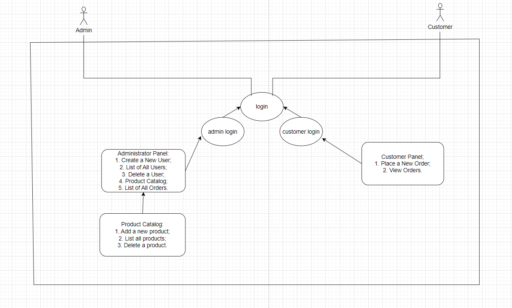
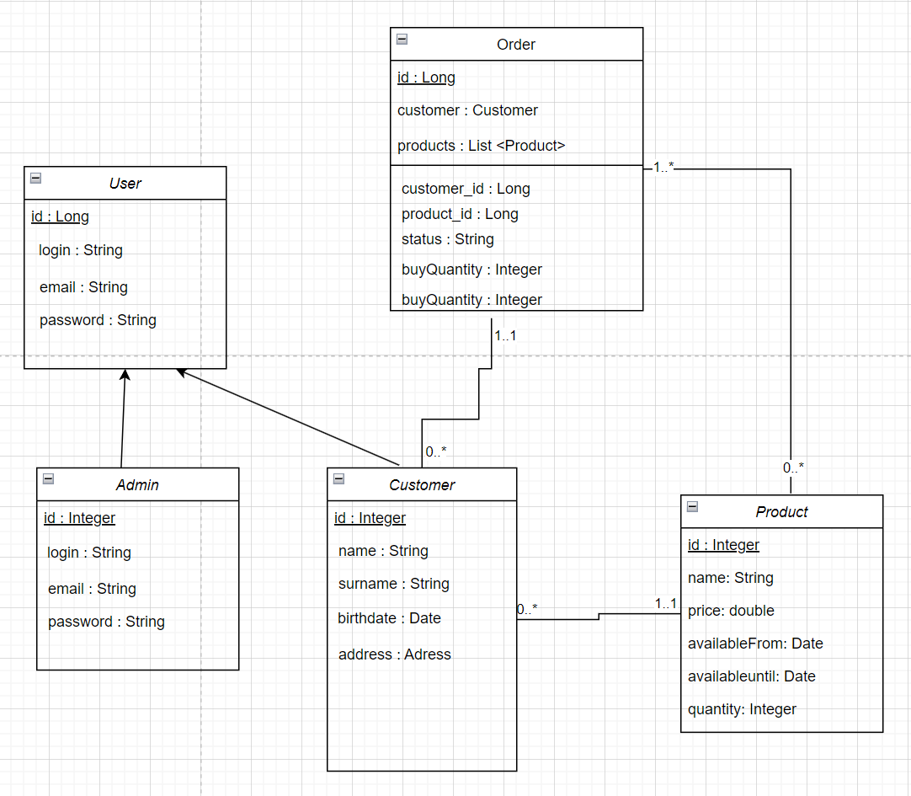

# Order_Management_Java
Order management system for product catalog in Java.
This application implements a simple order management system for a product catalog.
It defines the core entities like User, Admin, Customer, Product, and Order, and provides functionalities for user administration, product catalog management, and order processing. 

MyWebApp Application
The MyWebApp application is a Java-based Spring Boot application that provides functionality for managing users, products, and orders through a command-line interface. It is designed for both administrators and customers to interact with the system.

Features

User Authentication

Users are required to log in using their credentials (login name and password) to access the application.
User authentication is handled through the authenticateUser method in the UserService.

User Management

Administrators can create new users, including both administrators and customers.
Users can be created with various details, such as name, surname, birth date, address, email, and password.
User information is stored in the database and managed by the UserService.

Administrator Panel

The administrator panel allows users with the "ADMIN" role to perform various administrative tasks.
Administrators can create new users, list all users, and delete user accounts.

The "Product Catalog" feature allows administrators to manage the product inventory, including adding, listing, and deleting products.
Administrators can also view a list of all orders and exit the program.

Product Catalog

The product catalog management feature allows administrators to:
Add new products to the catalog, specifying details like name, sale price, availability dates, and quantity.
List all products in the catalog.
Delete products from the catalog.

Order Management

Customers can place new orders for products they wish to purchase.
Orders include information about the customer, product, quantity, and order status ("In Progress" in this context).
The application calculates the total price of orders for each customer and displays order details.

Customer Panel

Customers, identified by the "CUSTOMER" role, have access to a simplified panel for placing orders and viewing their orders.
The customer panel provides options for placing new orders, viewing orders, and exiting the program.

Usage

To use the MyWebApp application, follow these steps:

Run the application by executing the MyWebAppApplication class.
Log in using your credentials (login name and password).

Depending on your role (admin or customer), you will have access to specific features:

Administrators can manage users, products, and orders through the administrator panel.
Customers can place orders, view their orders, and check the total price of their orders through the customer panel.

Note

This application is designed for demonstration and educational purposes, and it is implemented as a command-line application. In a production environment, a web-based interface or a dedicated user management system is typically used for better usability and security.

Please ensure that you have a compatible environment and necessary dependencies set up to run the Spring Boot application.

Code Structure

Class Definitions:

Admin, Customer, Product, Order, and User are entity classes that represent different data objects. They have attributes describing their properties.
CustomerAddress is a class representing the address information for customers.

class Admin {
- id: Long
- userLogin: String
- userEmail: String
- userPassword: String
  }

class Customer {
- id: Long
- userLogin: String
- userEmail: String
- userPassword: String
- customerName: String
- customerSurname: String
- customerBirthDate: Date
- customerAddress: CustomerAddress
  }

class CustomerAddress {
- street: String
- zipCode: String
- city: String
- country: String
  }

class Product {
- id: Long
- productName: String
- salePrice: double
- availableFrom: Date
- availableUntil: Date
- quantity: int
  }

class Order {
- id: Long
- quantity: int
- product: Product
- user: User
- status: String
  }

class User {
- id: Long
- userLogin: String
- userEmail: String
- userPassword: String
- role: Role
- orders: List<Order>
  }

Repositories:

AdminRepository, CustomerRepository, ProductRepository, OrderRepository, and UserRepository are repository classes that define methods for interacting with the data entities. These repositories often use Spring Data's JpaRepository or CrudRepository for basic CRUD operations.

Services:

OrderService, ProductService, and UserService are service classes responsible for implementing business logic. They provide methods for saving, listing, deleting, and performing other operations related to orders, products, and users.

OrderService:

void save(Order order)
List<Order> listAll()
Order find(Long id)
Order create(Customer customer, int quantity, Product product, String status)
double calculateTotalPrice(User user)
List<Order> findLastOrderForUser(User user)
void delete(Long id)
String convertOrdersToJson() throws JsonProcessingException
String getOrdersJsonForUser(User user) throws JsonProcessingException

ProductService:

Product add(Product product)
void save(Product product)
List<Product> listAll()
void delete(Long id)
String listAllProductsInJson() throws JsonProcessingException

UserService:

List<User> listAll()
String listAllJSOn() throws JsonProcessingException
void save(User user)
User get(Long id)
void delete(String userLogin)
User authenticateUser(String enteredLogin, String enteredPassword)
User editUser(Long userId, String newUserName, String newUserEmail, String newUserPassword)
Date scanToDate(String input) throws ParseException

Test Classes:

OrderTest, ProductTest, and UserTest are test classes used to test the functionality of the application. They contain various test methods that verify if the application's components work correctly.

OrderTest Class:
Class Name: OrderTest

Attributes: No specific attributes as it is a test class.
Methods:
testCreateOrderMock(): Verifies if an order is successfully created in a mock repository.
testCreateOrderIntegration(): Tests integration, checking if an order is successfully created in the database.
testDeleteOrder(): Verifies if an order is deleted.
testDeleteOrderNotFound(): Checks if an exception is thrown when attempting to delete a non-existent order.
testListAllOrders(): Verifies if all orders are successfully listed.
testGetOrder(): Checks if an order is retrieved by its ID.
testUpdateOrderStatus(): Verifies if the status of an order is updated.
testSaveOrder(): Tests if an order is successfully saved.
testCalculateTotalPrice(): Checks the calculation of the total price for a user's orders.
testConvertOrdersToJson(): Verifies the conversion of orders into JSON format.

ProductTest Class:
Class Name: ProductTest

Attributes: No specific attributes as it is a test class.
Methods:
testAddProduct(): Verifies if a product is successfully added to the repository.
testListAllProducts(): Checks if all products are successfully listed.
testDeleteProduct(): Verifies if a product is deleted.
testDeleteProductNotFound(): Checks if an exception is thrown when attempting to delete a non-existent product.

UserTest Class:
Class Name: UserTest

Attributes: No specific attributes as it is a test class.
Methods:
testListAllJSON(): Verifies the generation of a JSON representation of all users (both admins and customers).
testListAllCustomers(): Tests the generation of a list of all customer users.
testListAllAdmins(): Checks the generation of a list of all admin users.
testGetUserById(): Verifies if a user is retrieved by ID.
testGetUserByIdNotFound(): Checks if an exception is thrown when attempting to retrieve a non-existent user by ID.
testDeleteUser(): Verifies if a user is deleted by login name.
testDeleteUserNotFound(): Checks if an exception is thrown when attempting to delete a non-existent user by login name.
testUpdateAdmin(): Verifies the update of admin users.

